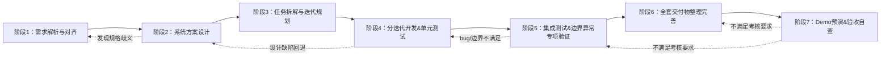

# 场景一
基于开源脚手架ruoyi-cloud(https://gitee.com/y_project/RuoYi-Cloud)改造

## 目录
- docs：场景一相关的文档，按照需求分析、系统方案设计、项目计划、研发任务拆分、测试用例创建划分
- frontend：前端项目文件夹
- backend：后端项目文件夹

## 开发流程说明
按照业务规格说明书，进行需求分析、系统方案设计、任务拆解与迭代规划后，按开发任务进行开发、测试

## 技术栈
- 前端：vue生态
- 后端：java微服务生态

详情见前后端项目README.md
## 项目启动
- 前端：见frontend/README.md
- 后端：见backend/README.md

## 环境与配置
见前、后端项目README.md

## 数据初始化
见后端项目README.md

## 模型配置
见后端项目README.md

## 主要业务流程
见docs/1-需求分析/01_需求分析.md

## 已实现范围
需求分析、系统方案设计、项目计划、测试用例设计，迭代S0

## 重要技术取舍
见docs/2-系统方案设计/02_技术方案设计.md

## 简化或未完成内容
1. 没有用户上传的pdf附件示例，功能只做了设计，无法开发与验证
2. ...

## 继续开发时的优先补齐方向
1. 用户上传的pdf附件示例
2. 按项目计划开发
3. ...