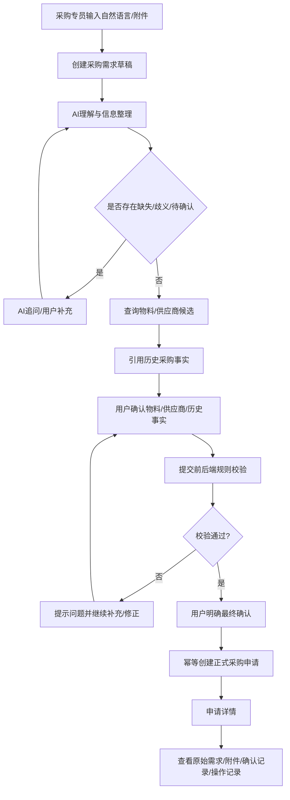
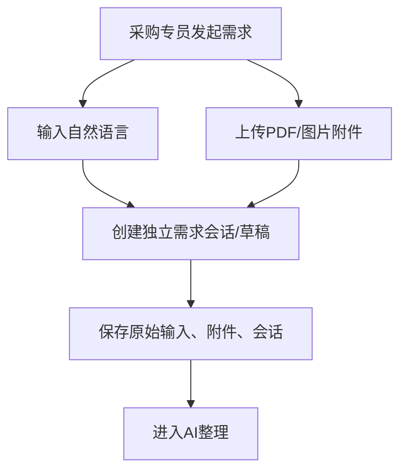
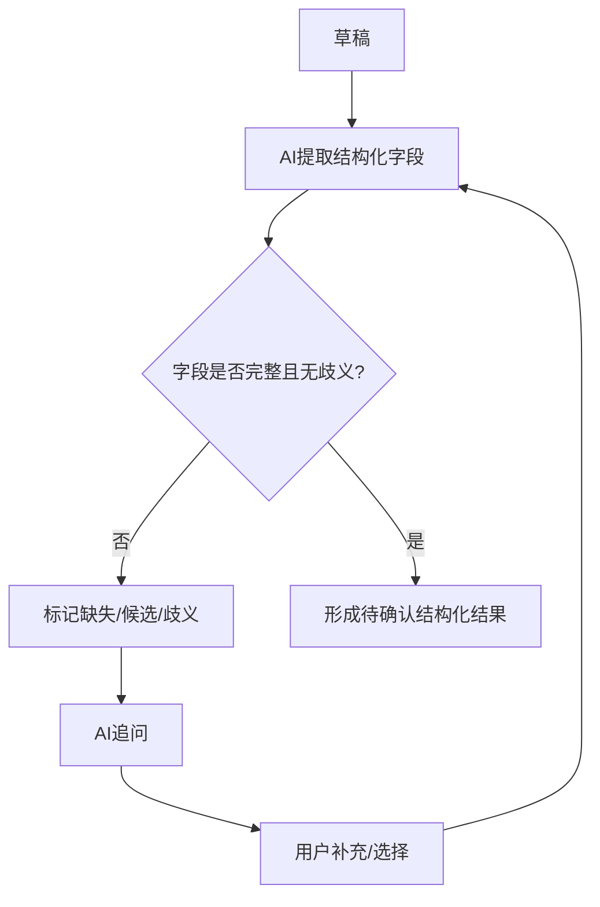
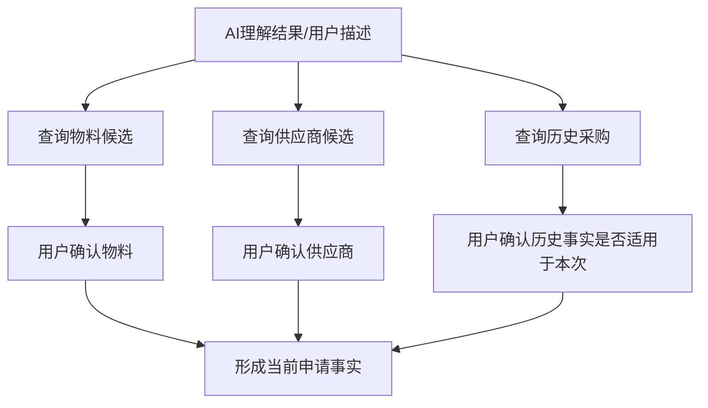
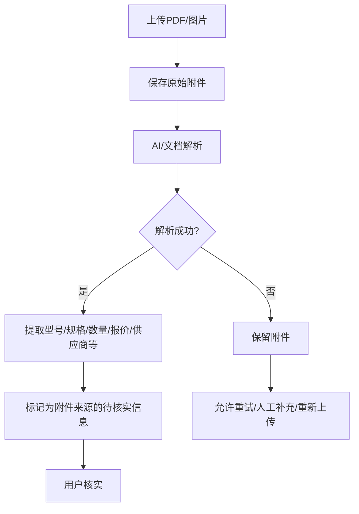
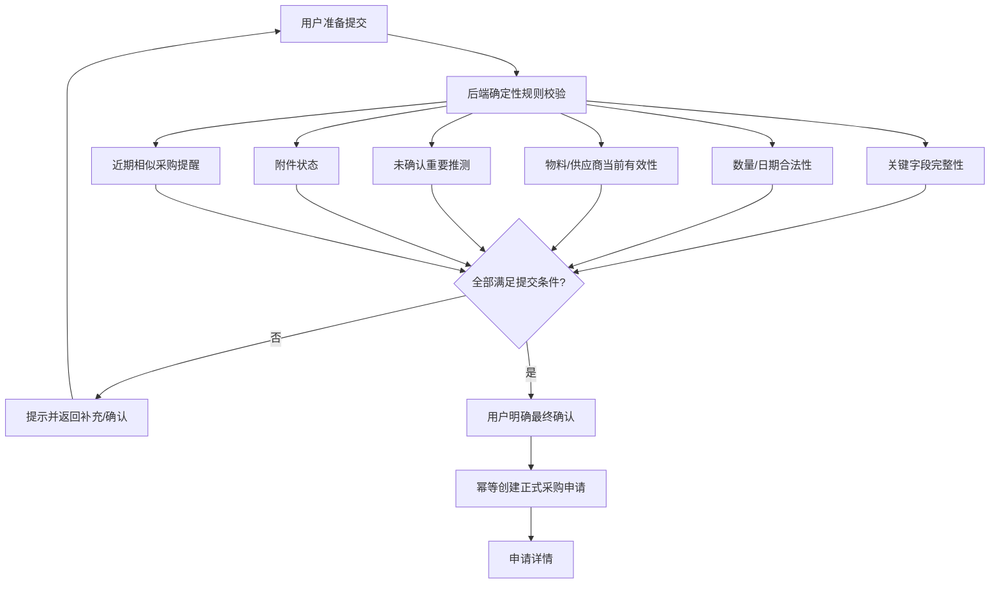

# 场景1：智能采购需求建单与供应商事实确认——需求分析

> 来源：用户提供的《场景1.md》。本分析仅基于原始场景要求，并在“Vue 生态 + Java 微服务生态”的约束下做必要的工程化拆分。原文明确要求完成从自然语言/附件输入到正式采购申请的业务闭环，并强调 AI 不能替代关键业务确认。 

## 1. 需求分析逻辑

采用“业务流程 → 流程节点 → 功能需求/非功能需求/异常/技术约束/验收标准”的拆分方法：
1. 先把原始场景中的目标闭环拆成可独立验收的业务流程。
2. 每个流程只描述一个相对完整的业务目的，避免按页面拆需求。
3. 从原文抽取业务规则、异常和边界；没有原文明确要求的地方标为“建议/工程实现”，不作为业务事实。
4. 将可验证条件写成验收标准，为后续测试用例提供直接输入。

## 2. 主要业务流程图

### 2.1 总体业务闭环



原文目标闭环为“自然语言或附件需求 → AI 理解 → 缺失/歧义确认 → 物料/供应商/历史事实核实 → 用户补充选择 → 提交前校验 → 用户明确确认 → 创建正式采购申请 → 查看详情”。 

### 2.2 流程一：需求创建与草稿持久化



### 2.3 流程二：AI理解、追问与结构化确认



### 2.4 流程三：物料、供应商与历史事实确认



### 2.5 流程四：附件处理与事实核实



### 2.6 流程五：提交前校验与正式提交



## 3. 按业务流程拆分需求

### 流程一：需求创建与草稿持久化

#### 功能需求
- 支持采购专员输入自然语言采购需求。
- 支持上传 PDF、图片等采购附件。
- 每条采购需求拥有独立会话/草稿。
- 保存原始输入、AI 对话、结构化字段、候选项、附件、确认记录、提交状态。
- 页面刷新/重新进入后可恢复草稿。
- 附件上传成功后即使后续解析失败，原始附件仍保留。

#### 非功能需求
- 数据持久化可靠。
- 用户间需求、草稿、附件必须后端隔离。
- 会话状态可恢复。
- 上传与草稿保存过程应具备可观测错误信息。

#### 异常场景
- 附件上传失败。
- 附件上传成功但解析失败。
- 网络中断后页面刷新。
- 用户同时处理多条需求。
- 用户切换会话后旧请求返回。

#### 技术约束
- 前端：Vue 生态，建议 Vue 3 + TypeScript。
- 后端：Java 微服务生态。
- 草稿与正式申请分离，正式提交前不能创建正式采购申请。
- 会话必须带业务需求唯一标识，异步 AI 返回必须绑定该标识。

#### 验收标准
- 可以创建多条独立采购需求。
- 页面刷新/重新进入能够恢复对应草稿。
- 上传成功的附件在解析失败后仍可见、可重试或人工处理。
- A 会话的异步返回不能写入 B 会话。
- 不同用户不能读取其他用户草稿或附件。

### 流程二：AI理解、追问与结构化确认

#### 功能需求
- AI 根据自然语言和附件内容提取结构化字段。
- 采购申请核心字段包括：物料、规格/型号、数量、单位、期望交付日期、项目/采购用途；按需支持预算、优先品牌、指定/优先供应商、联系人、附件。
- 无法确定的信息必须标记为待确认、候选或歧义。
- AI 可通过追问推动用户补齐信息。
- 用户可以人工补充/修改当前草稿。

#### 非功能需求
- AI 输出不能绕过用户确认直接成为正式业务事实。
- AI 调用失败、超时、异常时不得丢失用户输入和已确认事实。
- AI 输出应可追溯到输入来源（自然语言、附件、历史事实等）。

#### 异常场景
- 模型超时。
- 模型调用失败。
- 模型输出结构异常。
- 模型产生与正式主数据不一致的候选。
- 用户在 AI 生成过程中切换需求。

#### 技术约束
- AI 负责理解、抽取、追问、候选生成；确定性业务规则由后端执行。
- AI 不得创建/修改物料和供应商主数据。
- 建议 AI 输出采用结构化 JSON Schema，再由 Java 服务做 schema 校验和业务校验。

#### 验收标准
- 模糊需求可被整理成结构化字段。
- 缺失/歧义字段明显进入待确认状态。
- AI 推测不能直接变成最终确认值。
- AI 异常时原始输入与已确认事实保留。

### 流程三：物料、供应商与历史事实确认

#### 功能需求
- 根据描述/AI 结果查询物料候选。
- 根据描述/AI 结果查询供应商候选。
- 用户最终选择物料和供应商。
- 支持“参考上次采购”等历史引用。
- 展示历史申请中可参考的物料、规格、数量、品牌、供应商等信息。
- 当前申请中的联系人、预算、备注、已失效对象等不能自动继承为最终值。

#### 非功能需求
- 物料/供应商有效性以当前主数据状态为准。
- 查询失败不能破坏当前草稿。
- 关键确认动作必须可审计。

#### 异常场景
- 物料查询超时/失败。
- 供应商查询超时/失败。
- 历史引用对象已经停用。
- 候选为空。
- 候选多个且存在歧义。

#### 技术约束
- 主数据是正式事实源。
- AI 只能调用查询能力，不能直接修改主数据。
- 查询结果需要返回对象状态，提交时再次以后端实时状态校验为准。

#### 验收标准
- 用户可以从候选中确认物料/供应商。
- 停用物料/供应商不能被当作当前有效对象直接提交。
- 历史信息只作为参考，关键字段需要重新确认。
- 查询失败后草稿不丢失，可重试或人工补充。

### 流程四：附件解析与信息核实

#### 功能需求
- 上传 PDF/图片。
- 解析实际附件内容。
- 提取型号、规格、数量、报价、供应商等信息。
- 标记信息来源为附件。
- 允许解析失败后重试/人工补充/重新上传。

#### 非功能需求
- 原始附件不可因解析失败而丢失。
- 附件解析结果与正式主数据明确区分。
- 大文件/异常文件应有明确失败反馈。

#### 异常场景
- 上传失败。
- 文件格式不支持。
- 解析超时。
- OCR/模型失败。
- 解析结果为空或低置信度。

#### 技术约束
- 原始文件与解析结果分开持久化。
- 解析服务异步化时必须以 attachmentId + requirementId 关联结果。
- 解析结果不能绕过用户确认直接成为正式采购事实。

#### 验收标准
- PDF/图片上传后可以查看原文件。
- 成功解析时可以查看提取结果及来源。
- 解析失败时附件仍存在。
- 重新解析不会生成重复附件记录。

### 流程五：提交前校验与正式提交

#### 功能需求
- 后端校验关键字段完整性。
- 校验数量、日期合法性。
- 校验物料、供应商当前有效性。
- 校验是否存在未确认的重要推测。
- 校验附件状态。
- 检查近期可能重复采购需求并提醒。
- 校验通过后要求用户明确最终确认。
- 创建正式采购申请。
- 提交必须幂等。
- 提交后进入可恢复详情页，展示最终内容、原始需求、附件、确认/操作记录。

#### 非功能需求
- 正式提交必须强一致地避免重复创建。
- 关键业务规则以后端确定性逻辑为准。
- 提交、确认、状态变更应可审计。
- 生产提交接口应具备可追踪 requestId / idempotencyKey。

#### 异常场景
- 连续点击提交。
- 网络重试导致重复请求。
- 页面刷新后重复提交。
- 物料/供应商在草稿期间被停用。
- 相似申请存在。
- 提交过程中数据库/下游服务异常。

#### 技术约束
- 推荐采用 Spring Boot + Spring Cloud 微服务体系。
- 正式创建采用幂等键 + 数据库唯一约束/状态控制双保险。
- 相似申请仅提醒，不因相似度自动禁止提交。
- 提交前必须重新读取关键主数据有效性。

#### 验收标准
- 所有必要信息确认后才能提交。
- 未确认重要推测不能提交。
- 停用物料/供应商不能提交。
- 相似申请只产生提醒。
- 同一业务提交请求重复发送，只创建一张正式采购申请。
- 提交后详情可恢复并能查看关键操作记录。

## 4. 全局非功能需求

| 类别 | 要求 |
|---|---|
| 安全 | 用户数据、草稿、附件后端隔离；角色权限控制 |
| 可追溯性 | 原始输入、AI对话、确认记录、操作记录可查询 |
| 一致性 | 正式采购申请创建必须幂等；提交前关键事实以后端校验为准 |
| 可恢复性 | 草稿、附件、已确认事实在刷新/异常后不丢失 |
| 可用性 | AI、查询、解析服务失败时仍允许人工继续 |
| 可观测性 | AI调用、附件解析、主数据查询、提交请求应有 requestId/业务ID |
| 可测试性 | AI 与确定性规则分层，核心提交规则可独立自动化测试 |

## 5. 需求基线与后续输出关系

```text
本需求分析
   ├── 业务流程 → 技术方案中的服务/API/状态机
   ├── 功能需求 → 开发任务
   ├── 非功能需求 → 架构/组件/质量属性
   ├── 异常场景 → 异常处理 + 测试用例
   ├── 技术约束 → 技术方案
   └── 验收标准 → QA测试 + 产品UAT
```
