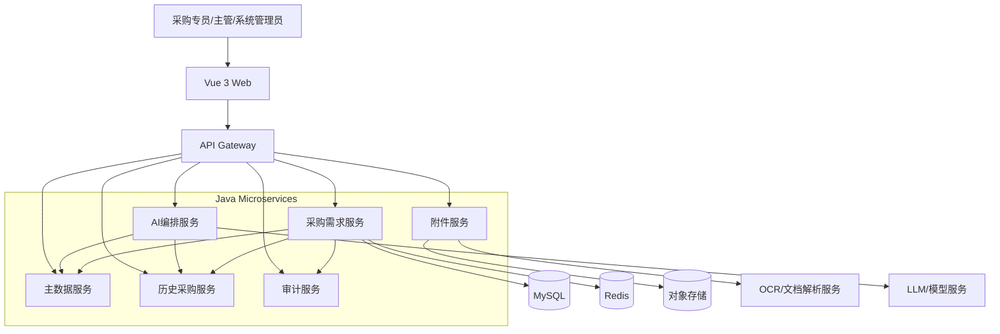
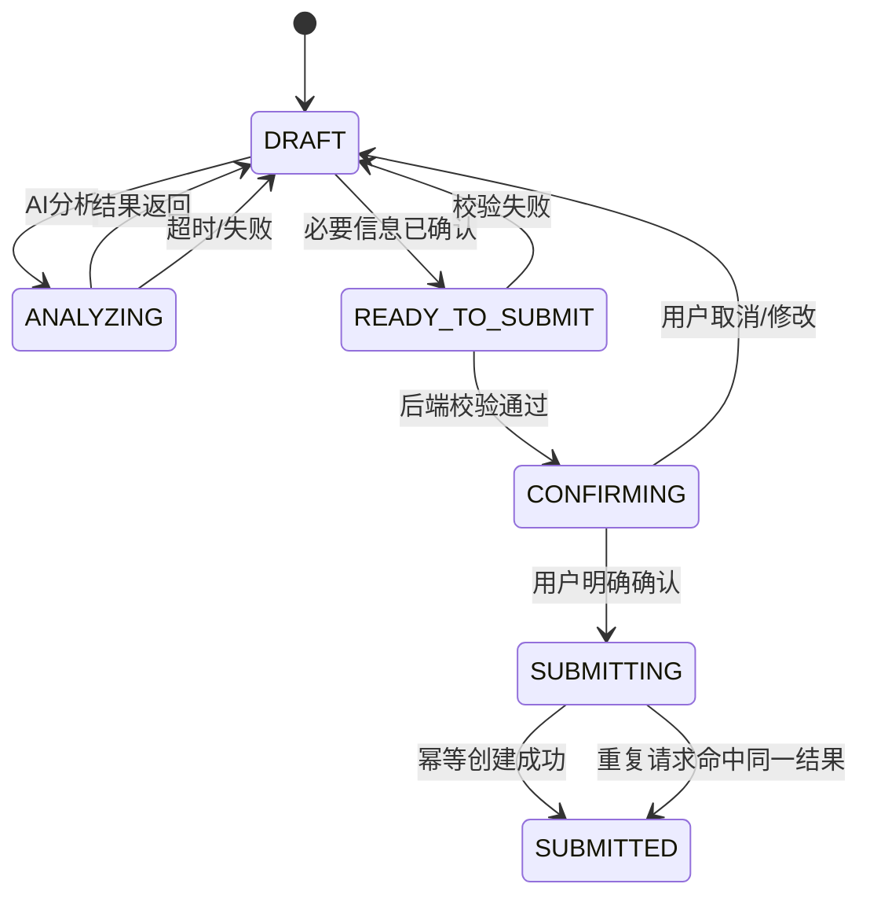
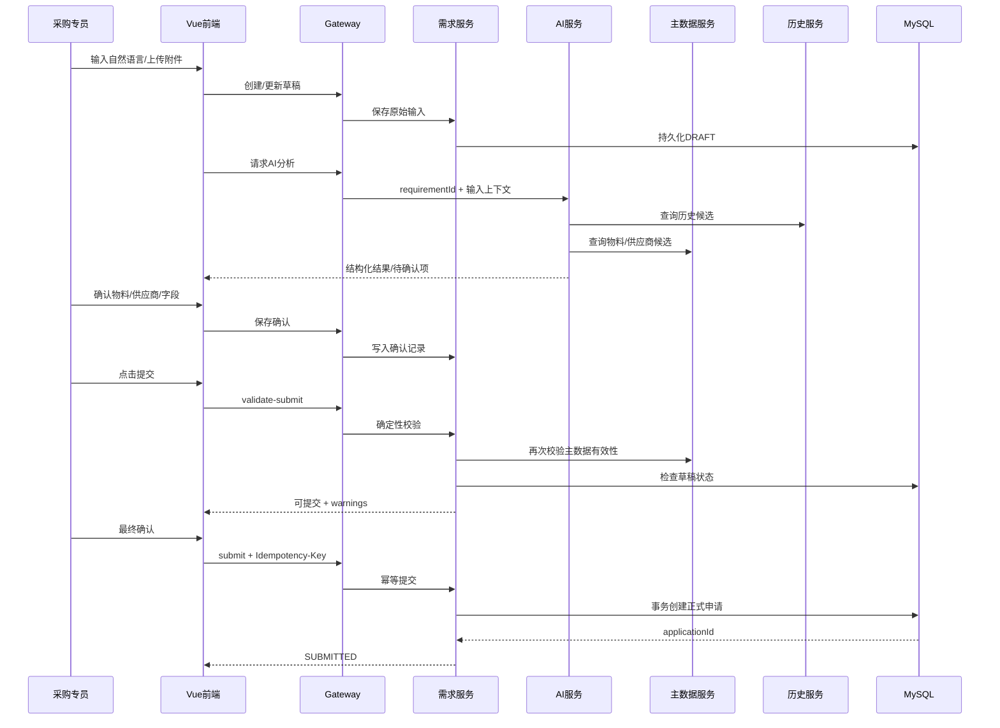

# 场景1：智能采购需求建单与供应商事实确认——技术方案设计

## 1. 设计逻辑

本方案将系统拆成“Vue 前端 + Java 微服务 + AI/文档解析 + 主数据/历史数据”的分层架构。

核心设计原则：
1. **AI 与确定性业务规则分离**：AI 做理解、抽取、追问、候选；Java 后端做权限、主数据有效性、字段完整性、提交规则、幂等。
2. **草稿与正式申请分离**：AI 只能操作草稿域；正式采购申请只能由明确确认后的后端事务创建。
3. **主数据是事实源**：物料/供应商最终状态以后端主数据查询结果为准。
4. **异步结果必须绑定业务上下文**：AI/附件解析返回必须携带 requirementId/attachmentId，防止串会话。
5. **提交幂等**：幂等键 + 数据库唯一约束/状态控制。

## 2. 推荐技术栈

### 前端
- Vue 3
- TypeScript
- Vite
- Pinia
- Vue Router
- Axios
- SSE/WebSocket：用于 AI 流式输出（具体选型可按现有基础设施）
- Element Plus 或企业现有 Vue UI 组件库

### 后端
- Java 17+
- Spring Boot
- Spring Cloud / Spring Cloud Alibaba（若团队已有该生态）
- Spring MVC
- MyBatis-Plus 或 MyBatis
- MySQL
- Redis
- Object Storage（MinIO/OSS 等）
- OpenFeign / WebClient
- 消息队列可选，用于附件解析、AI异步任务

## 3. 系统整体架构图



## 4. 核心领域模型

```text
PurchaseRequirement
- id
- applicantId
- status: DRAFT / READY_TO_SUBMIT / SUBMITTED
- rawInput
- structuredData
- confirmationStatus
- createdAt / updatedAt

RequirementConversation
- id
- requirementId
- role: USER / ASSISTANT / SYSTEM
- content
- sourceType
- createdAt

RequirementCandidate
- id
- requirementId
- type: MATERIAL / SUPPLIER / HISTORY
- candidateId
- candidateData
- status: CANDIDATE / CONFIRMED / REJECTED

Attachment
- id
- requirementId
- fileName
- storageKey
- parseStatus
- parseResult
- sourceType

ConfirmationRecord
- id
- requirementId
- fieldName
- oldValue
- newValue
- source
- confirmedBy
- confirmedAt

PurchaseApplication
- id
- requirementId
- applicationNo
- status
- submittedBy
- submittedAt

AuditLog
- id
- requirementId
- operatorId
- action
- detail
- createdAt
```

## 5. 关键接口文档

> 下面为本次需求可直接进入开发评审的接口初稿。字段可在技术评审后进一步固化。

### 5.1 创建采购需求草稿

**POST** `/api/v1/purchase-requirements`

Request:
```json
{
  "rawInput": "下周装配线需要200个耐高温轴承，跟上次采购的差不多"
}
```

Response:
```json
{
  "requirementId": "REQ202609020001",
  "status": "DRAFT"
}
```

### 5.2 获取采购需求详情

**GET** `/api/v1/purchase-requirements/{requirementId}`

Response:
```json
{
  "requirementId": "REQ202609020001",
  "status": "DRAFT",
  "rawInput": "...",
  "structuredData": {
    "material": null,
    "specification": null,
    "quantity": 200,
    "unit": "个",
    "expectedDeliveryDate": null,
    "purpose": "装配线"
  },
  "confirmations": [],
  "attachments": []
}
```

### 5.3 AI分析/追问

**POST** `/api/v1/purchase-requirements/{requirementId}/ai/messages`

Request:
```json
{
  "message": "品牌优先用原来的"
}
```

Response:
```json
{
  "messageId": "MSG001",
  "answer": "我找到历史采购中的相关品牌候选，请确认是否采用。",
  "structuredChanges": [],
  "pendingConfirmations": [
    {
      "field": "preferredBrand",
      "status": "CANDIDATE"
    }
  ]
}
```

### 5.4 上传附件

**POST** `/api/v1/purchase-requirements/{requirementId}/attachments`

`multipart/form-data`

Response:
```json
{
  "attachmentId": "ATT001",
  "fileName": "bearing-spec.pdf",
  "parseStatus": "PENDING"
}
```

### 5.5 查询物料候选

**GET** `/api/v1/materials/candidates?keyword=耐高温轴承`

Response:
```json
{
  "items": [
    {
      "materialId": "MAT001",
      "materialCode": "BRG-001",
      "name": "耐高温轴承",
      "specification": "...",
      "status": "ACTIVE"
    }
  ]
}
```

### 5.6 查询供应商候选

**GET** `/api/v1/suppliers/candidates?keyword=原供应商`

Response:
```json
{
  "items": [
    {
      "supplierId": "SUP001",
      "name": "供应商A",
      "status": "ACTIVE"
    }
  ]
}
```

### 5.7 查询历史采购

**GET** `/api/v1/purchase-history/candidates?requirementId=REQ202609020001`

Response:
```json
{
  "items": [
    {
      "applicationId": "POREQ20260801001",
      "materialId": "MAT001",
      "supplierId": "SUP001",
      "brand": "品牌A",
      "quantity": 180
    }
  ]
}
```

### 5.8 确认字段

**POST** `/api/v1/purchase-requirements/{requirementId}/confirmations`

Request:
```json
{
  "field": "materialId",
  "value": "MAT001",
  "source": "USER_SELECTION"
}
```

### 5.9 提交前校验

**POST** `/api/v1/purchase-requirements/{requirementId}/validate-submit`

Response:
```json
{
  "canSubmit": true,
  "errors": [],
  "warnings": [
    {
      "code": "SIMILAR_PURCHASE",
      "message": "近期存在相似采购申请"
    }
  ]
}
```

### 5.10 正式提交

**POST** `/api/v1/purchase-requirements/{requirementId}/submit`

Header:
```text
Idempotency-Key: 8c7f2c...
```

Request:
```json
{
  "confirm": true
}
```

Response:
```json
{
  "applicationId": "PA202609020001",
  "applicationNo": "PR202609020001",
  "status": "SUBMITTED"
}
```

### 5.11 查询申请详情

**GET** `/api/v1/purchase-applications/{applicationId}`

Response:
```json
{
  "applicationId": "PA202609020001",
  "applicationNo": "PR202609020001",
  "status": "SUBMITTED",
  "content": {},
  "attachments": [],
  "confirmations": [],
  "auditLogs": []
}
```

## 6. 核心状态机



## 7. 核心交互时序：AI整理 + 提交



## 8. AI/确定性规则边界

| 能力 | AI | 后端确定性规则 |
|---|---|---|
| 自然语言理解 | ✓ | |
| 字段抽取 | ✓ | Schema校验 |
| 缺失项识别 | ✓ | 必填规则最终判定 |
| 候选推荐 | ✓ | 候选查询及有效性 |
| 历史内容理解 | ✓ | 历史数据真实性 |
| 物料是否有效 | | ✓ |
| 供应商是否有效 | | ✓ |
| 数量/日期是否合法 | | ✓ |
| 是否允许提交 | | ✓ |
| 是否创建正式申请 | | ✓ |
| 幂等 | | ✓ |
| 主数据修改 | 不允许 | 按授权后台能力 |

## 9. 安全与一致性

- Gateway 统一鉴权。
- 需求详情、附件、确认记录均按 userId/role 做后端数据权限过滤。
- `Idempotency-Key` 建议落库并建立唯一索引。
- 正式提交在事务中完成：校验草稿状态 → 创建申请 → 更新草稿状态。
- 主数据有效性在提交瞬间重新校验。
- AI 产生的结构化结果不能直接覆盖已确认事实，建议以 `source + confirmationStatus` 区分。
